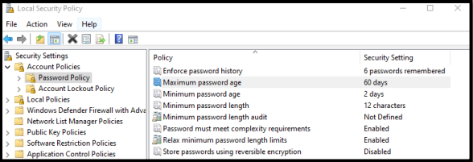
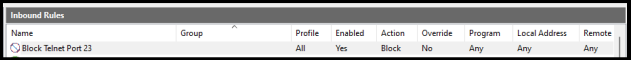
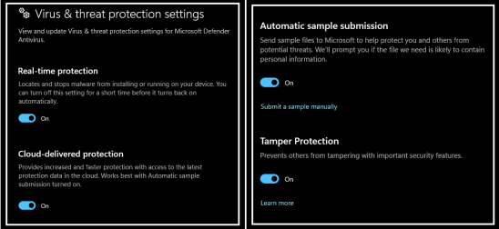
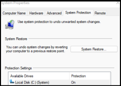
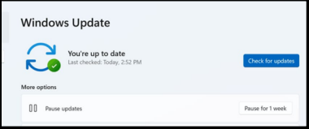
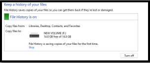
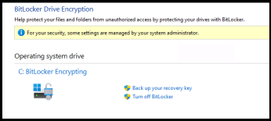

# 🔐 Windows Security Hardening – CIA Triad Implementation

## 📌 Project Overview
This project was conducted on a Windows 11 system to improve its security 
posture through practical security controls based on the CIA Triad principles.

| Principle | Goal |
|---|---|
| **Confidentiality** | Protect sensitive information from unauthorized access |
| **Integrity** | Prevent unauthorized changes to data and systems |
| **Availability** | Ensure systems and data are accessible when required |

---

## 🛡️ Security Controls Implemented

### 🔒 Confidentiality
- Enabled BitLocker Drive Encryption  
- Configured Strong Password Policy (12 chars, complexity enabled)

### 🛡️ Integrity
- Configured Windows Defender Firewall (blocked Port 23 / Telnet)  
- Enabled Windows Defender (Real-time, Cloud, Tamper Protection)  
- Applied latest Windows Updates

### ⚡ Availability
- Disabled unnecessary services (Remote Registry)  
- Enabled File History Backup  
- Created System Restore Point

---

## 🧰 Tools Used
- Windows 11  
- Windows Defender & Firewall  
- Local Security Policy (secpol.msc)  
- File History & System Restore

---

## 📈 Skills Gained
- System Hardening & Risk Mitigation  
- Security Configuration  
- Defensive Security  
- CIA Triad practical application

---

## 📄 Report
Full report with before/after screenshots available: [View Report]([link-here](https://drive.google.com/file/d/1dy7etHVMTpIlQOhp2S5qI9q19iRnCuaj/view?usp=sharing))

---

**Author:** Muhammad Afaq Abbas — Cybersecurity Student  
**Date:** 13/02/2026

## 📸 Screenshots

### 🔒 Password Policy

### 🔥 Firewall Rule (Port 23 Blocked)

### 🛡 Virus & Threat Protection

### 🛠 System Protection / Restore Point

### 🔄 Windows Update

### 💾 File History Backup

### 🔐 BitLocker Enabled

